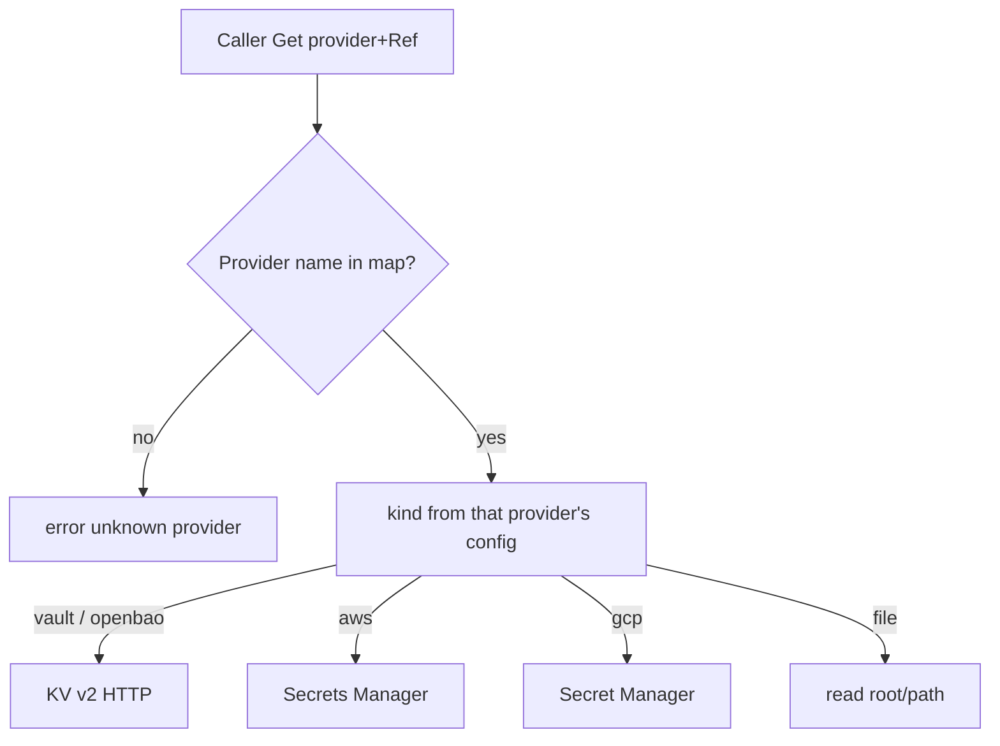

# caerus-framework-secrets

[](https://github.com/caerus-framework/caerus-framework-secrets/actions/workflows/ci.yml)
[](https://codecov.io/gh/caerus-framework/caerus-framework-secrets)
[](LICENSE)

Caerus Framework **secrets chassis**. One component holds several **named
providers**. Callers ask for a secret by **provider name** plus a path/key;
they do **not** switch on Vault vs AWS vs GCP themselves.

This module is declared in `main` like postgres/valkey. It is **not**
auto-registered with logs/configuration/observability. It initializes in the
bootstrap **`secrets`** stage (after configuration, before data) so data
clients can read credentials during their own `Init` if they hold this
component pointer.

## Design (why named providers)

Wrong vs right:

```text
Wrong: GetSecret("db_password") and the chassis guesses the backend
Right: Get(ctx, "openbao", Ref{Path: "app/db", Key: "password"})

Wrong: app code `switch cfg.Kind { case "aws": … case "vault": … }`
Right: app code always calls Get; kind is only in secrets.json
```

**Provider name** (map key, `Get`’s first argument) and **kind** (which API)
are two different strings. Prefer matching them when you have one backend
(`"openbao"` + `kind: "openbao"`). They may differ (`"prod-kv"` +
`kind: "vault"`).

**OpenBao vs Vault** are two **kinds** that share the same KV v2 HTTP client.
They are not two SDKs. Use `kind: openbao` or `kind: vault` so metrics and
docs say which product you pointed `address` at. Kubernetes auth (`k8s_role`)
and token file (`token_path`) are the same for both.

**This is not External Secrets Operator.** ESO copies Bao/Vault into a
Kubernetes Secret for the pod. This chassis is for **in-process** fetches
(apps that call Get at Init or per use). You can use both: ESO for the
GitHub App PEM, this module for app-level secrets later.

Credentials for talking *to* the backends (Bao token, AWS chain, GCP ADC)
are still a bootstrap problem: they live in this component’s config file or
the cloud default chain. We will grow AppRole / extra AWS/GCP settings when
the file shape below is wrong for a real deploy.

## Wiring

Two wiring shapes. Prefer the **app-owned** shape.

### App-owned consumer (golden — demoapp pattern)

`main` declares secrets as chassis. The app stores `*CFSecrets` and calls
`Get` / `GetString` per use (do not snapshot the bytes at Init if the owner
must see rotations — call Get again, or reload via config).

```go
fw := cf.New(&cf.FrameworkOptions{
	Logs:          &cf.LogsSettings{Format: "json", Level: "info", ConfigSource: "logs"},
	Observability: &cf.ObservabilitySettings{Bind: ":9090", ConfigSource: "observability"},
	Components: []cf.CaerusComponent{
		cf_secrets.New(cf_secrets.WithConfigSource("secrets", "config/secrets.json")),
		cf_postgres.New(cf_postgres.WithConfigSource("postgresql", "config/postgresql.json")),
		app.New(),
	},
})
```

```go
type App struct {
	secrets *cf_secrets.CFSecrets
}

func (a *App) GetDependencies() []string {
	return []string{cf_secrets.ComponentName} // "secrets", not the source nickname
}

func (a *App) Init(ctx context.Context, fw *cf.CaerusFramework) error {
	sec, ok := cf.Get[*cf_secrets.CFSecrets](fw)
	if !ok {
		return errors.New("app: secrets component missing")
	}
	a.secrets = sec
	return nil
}

func (a *App) webhookHMAC(ctx context.Context) (string, error) {
	return a.secrets.GetString(ctx, "openbao", cf_secrets.Ref{
		Path: "caerus-framework/release-train-gh-app",
		Key:  "webhook-secret",
	})
}
```

### Simple `main`-level wiring

```go
fw := cf.New()
fw.AddComponent(cf_logs.New(cf_logs.WithWriter(os.Stdout)))
fw.AddComponent(cf_secrets.New(cf_secrets.WithConfigSource("secrets", "config/secrets.json")))
```

Then `cf.MustGet[*cf_secrets.CFSecrets](fw)`. Same `Get` API.

## Configuration

File is canonical. Example `config/secrets.json`:

```json
{
  "degraded_mode": false,
  "health_when_degraded": "not_ready",
  "providers": {
    "openbao": {
      "kind": "openbao",
      "address": "https://openbao.example.com:8200",
      "kv_mount": "secret",
      "token_path": "/var/run/secrets/openbao/token"
    },
    "vault": {
      "kind": "vault",
      "address": "https://vault.example.com:8200",
      "kv_mount": "secret",
      "k8s_role": "release-train",
      "k8s_mount": "kubernetes"
    },
    "aws": {
      "kind": "aws",
      "region": "eu-central-1"
    },
    "gcp": {
      "kind": "gcp",
      "project": "my-gcp-project"
    }
  }
}
```

You only list the providers this process uses. An unused kind is omitted.

| Kind | `Get` Path | `Get` Key | Auth in v1 |
|---|---|---|---|
| `openbao` / `vault` | CLI-style KV path under `kv_mount` (not `data/…`) | property in the KV data map | `token` / `token_path`, or `k8s_role` (+ JWT file) |
| `aws` | Secrets Manager name or ARN | JSON object key if the secret string is JSON | AWS default credential chain (`region` required) |
| `gcp` | secret id, or full `projects/…/secrets/…` | JSON object key if payload is JSON | Application Default Credentials (`project` required) |
| `file` | path under `root` | JSON object key if the file is JSON | local / tests only |

`kind: file` is for laptop tests. It is not a production secret store.

### Vault/OpenBao KV path: CLI-style, driver inserts `/data/`

This module speaks **KV v2 only**. The HTTP API is
`GET /v1/<kv_mount>/data/<path>`. The Vault/OpenBao CLI hides that prefix:
`vault kv get secret/app/db` is the same secret as
`Ref{Path: "app/db"}` with `kv_mount: "secret"`.

Do **not** put `data/` in `Ref.Path`. The driver adds it. If you copy the
HTTP path (`data/app/db`), the request becomes
`/v1/secret/data/data/app/db` — a different (usually missing) secret, the
same footgun as `vault kv get secret/data/app/db`.

Do **not** omit `/data/` in the HTTP URL to “match the CLI.” Omitting it is
KV v1. This chassis does not speak KV v1.

```text
Wrong: Ref{Path: "data/app/db"} because you saw /v1/secret/data/ in the API docs.
Right: Ref{Path: "app/db"} — same string you pass after the mount to `vault kv get`.

Wrong: expect the driver to call /v1/secret/app/db (KV v1).
Right: KV v2 URL is always /v1/<kv_mount>/data/<path>.
```

`..`, empty segments, and backslashes in `Ref.Path` are rejected so the
process token cannot walk off `/v1/<mount>/data/`. `kv_mount` and
`k8s_mount` are `[A-Za-z0-9_-]+` (the CLI mount name, not a URL path).

### Address TLS (Vault/OpenBao)

**Path A (required):** `address` is `https://host:8200` (origin only — no
`/v1/...` path). Tokens stay on TLS.

**Path B (lab):** `allow_insecure_http: true` for `http://` (httptest /
laptop). Error log + `cf_secrets_allow_insecure_http`. Not production.

`tls_insecure_skip_verify` is a different lab switch (HTTPS, but do not
verify the cert). Error log + `cf_secrets_tls_insecure_skip_verify`. Never
production. It does **not** allow `http://`.

### Auth paths for Vault/OpenBao (pick one per provider)

**Path Token-file (typical in Kubernetes):** `token_path` points at a mounted
file; the process reads it at Init (and again if you later add reload-from-file).

**Path Kubernetes auth:** set `k8s_role`; the driver POSTs the service-account
JWT (`k8s_jwt_path`, default the in-cluster token path) to
`/v1/auth/<k8s_mount>/login`.

**Path Inline token (dev / break-glass):** `token` in the config file. Do not
use this in production files that are not a Secret.

### Trusted config (ops / Pod spec only)

These fields are opened as the process uid. There is no extra jail. Treat
them like configuration `Path`: only values that already come from the
chart, External Secrets mount, or laptop file.

| Field | Kind | What the process does |
|---|---|---|
| `address` | vault / openbao | HTTP client talks to that origin |
| `token_path` / `k8s_jwt_path` / `tls_ca_file` | vault / openbao | `os.ReadFile` |
| `endpoint` | aws | SDK endpoint override (LocalStack / tests) |
| `credentials_file` | gcp | Google ADC JSON path |
| `root` | file | directory jail for `Ref.Path` (this one *is* jailed) |

Wrong: pass a user-controlled AWS `endpoint` or GCP `credentials_file` from
a request. Right: chart/file only.

## Lifecycle

- **Init** builds clients and **pings** each provider (Vault/OpenBao
  `sys/health`, AWS `ListSecrets`, GCP list, file `stat` of `root`). Hard
  failure by default.
- **DegradedMode** lets Init finish when a ping fails; logs and metrics
  scream; `/readyz` stays red unless `health_when_degraded: ready`.
- **Get** always hits the live driver (no snapshot of secret bytes on the
  chassis).
- **OnConfigReload** rebuilds drivers; last-good stays if rebuild/ping fails
  (unless DegradedMode already allowed a partial set).



## Health and metrics

`Health` re-pings every provider. Metrics (`cf_secrets_*`) include provider
count, Get totals, ping failures, DegradedMode, and lab TLS/HTTP screams
(`cf_secrets_tls_insecure_skip_verify`, `cf_secrets_allow_insecure_http`).

## License

Apache License 2.0 — see [LICENSE](LICENSE) and [NOTICE](NOTICE).
